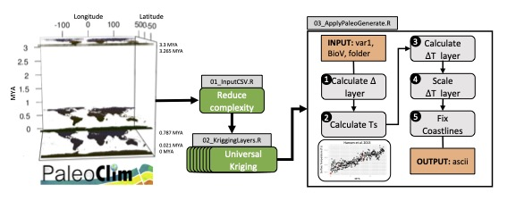

# PaleoGenerate

## Introduction  

High-resolution paleoclimatic datasets are broadly applicable to investigating drivers of contemporary biodiversity patterns. Generation of paleoclimatic layers is often done with proprietary software, which greatly limits new applications, particularly for those without advanced GIS skills. Here, we provide a completely open source-based approach to infer robust paleoclimatic layers, specifically annual mean temperature (bio1), for 50 distinct time segments between 0 and 3.3 MYA. In addition, we generate layers for five additional bioclimatic variables: temperature seasonality (bio4), annual precipitation (bio12), precipitation of wettest month (bio13), precipitation of driest month (bio14), and precipitation seasonality (bio15). 

PaleoGenerate is an R project used to generate Bioclim variables at time between 0 and 3.3 million years ago (MYA). This method is based on [Gamisch, 2019](https://onlinelibrary.wiley.com/doi/full/10.1111/geb.12979) and utilizes [PaleoClim layers](http://paleoclim.org/). 

  

| Variable |  |
| ------------ | ------------- |
| BIO1 | Annual Mean Temperature |
| BIO4 | Temperature Seasonality |
| BIO12 | Annual Precipitation |
| BIO13 | Precipitation of Wettest Month |
| BIO14 | Precipitation of Driest Month |
| BIO15 | Precipitation Seasonality |
 

Despite the ability of these scripts to generate predictions for additional variables, we caution this use. Historical trends in temperature and precipitation are temporally and spatially distinct; given the use of temperature data for extrapolation, we conservatively excluded layers that are based on a relationship between precipitation and temperature (Bio8–Bio11 and Bio16–Bio19). Our methods substantially improve upon Oscillayers [(Gamisch, 2019](https://onlinelibrary.wiley.com/doi/full/10.1111/geb.12979), a recent similar attempt to generate gridded paleoclimate data with high temporal resolution, which has been the subject of criticism [Brown et al. 2020](https://onlinelibrary.wiley.com/doi/full/10.1111/geb.13103). Our work addresses a number of these criticisms. Among the limitations pointed out by Brown et al. (2020)  is that the Oscillayers approach assumes no spatio-temporal variation in climates; this is potentially problematic because historical climate change had high spatial heterogeneity. We address this limitation by utilizing a stronger set of historical time periods through Paleoclim layers and avoid extrapolation in the predictions. However, as an important potential shortcoming, we point out that we are assuming a linear relationship between global temperature and precipitation for the precipitation datasets; therefore we caution care in the use of the the use of our precipitation layers (Bio12, Bio13, Bio14, and Bio15) but provide them for the benefit of interested users. 

---

## Workflow

### Input Files
Input data files (data.zip) were obtained from [PaleoClim layers](http://paleoclim.org/) ([Brown et al. 2018)](https://www.nature.com/articles/sdata2018254) included the following:

| Name | Age |
| ------------ | ------------- |
| Current | 1979 – 2013, marked as 0 Mya |
| Pleistocene: Last Glacial Maximum (LGM) | ca. 21 ka |
| Pleistocene: MIS19 | ca. 787 ka |
| Pliocene: mid-Pliocene warm period (Mid) | 3.264-3.025 Mya, set as equal to 3.264 Mya|
| Pliocene: M2 | ca. 3.3 Mya |

### 01_InputCSV.R
Prior to reconstructing time points, for each input layer we implemented a series of processing steps to reduce spatial resolution to reduce computational times for downstream extrapolation (see 01_InputCSV.R). First, given our interest was scoped to the northern hemisphere, we cropped the layers to the extent of 180 E, 180 W, 0 N, and 90 N using R package raster. We then aggregated each layer by a factor of two, resulting in four times fewer cells, using raster’s aggregate function. The raster was then converted to a dataframe for kriging. 

### 02_KriggingLayers.R
Universal kriging was used to calculate geographically interpolated surfaces with spatial linear dependence (see 02_KriggingLayers.R). For each dataframe, we determined a variogram where the bioclim variable values were linearly dependent on the spatial coordinates (i.e., in R notation, bio ~ longitude + latitude) with the autofitVariogram function from the R package [automaps](https://cran.r-project.org/web/packages/automap/index.html). Next, kriging was implemented using the krige function from the R package [gstat](https://cran.microsoft.com/snapshot/2019-05-02/web/packages/gstat/gstat.pdf) and finally interpolated surfaces were merged into one raster. Due to computational intensiveness, we parallelized the previous process by separating the raster into 30 dataframes, and after kriging we merged the 30 rasters back together. 

 
### 03_ApplyPaleoLayerGenerate.R
We created a function, Paleo_layergenerate, to automate production of layers between an indicated time period for a specific variable.    

First we calculated Δ layers between two input layers that are most similar in surface temperature to the desired time point using the temperature curve. We identified the surface temperature associated with the desired time point through linear interpolation on [Hansen (2013)](https://royalsocietypublishing.org/doi/10.1098/rsta.2012.0294) with the R function approx. We calculated the difference between the layer with the closest minimum surface temperature and the layer with the closest maximum surface temperature using the overlay function from the [raster R package](https://cran.r-project.org/web/packages/raster/index.html).    

We then calculated and applied a surface temperature correction. Specifically, the surface temperature correction was equal to (TSI - TSB)/(TSA - TSB), where TSI is the approximate value for the time being reconstructed or the temperature surface initial, TSA is the approximate value of the closest minimum surface temperature, and TSB is the approximate value of the closest maximum surface temperature. The Δlayers are scaled to represent differences in surface temperature, which is based on isotope records (Hansen et al. 2013; Gamisch 2019). ΔT layers are calculated, where BioΔT is equal to BioΔ multiplied by the surface temperature correction. 

Layers are then downscaled to the original resolution with the Delta method [(Ramírez Villegas and Jarvis 2010)
](https://cgspace.cgiar.org/handle/10568/90731) where the layer of the closest maximum surface temperature (TSB) is added to the BioΔT layer using the overlay function in [raster R package](https://cran.r-project.org/web/packages/raster/index.html).    

Using the [ETOPO1 Global relief model](https://www.ncei.noaa.gov/access/metadata/landing-page/bin/iso?id=gov.noaa.ngdc.mgg.dem:316) we corrected coastlines for each time period. Specifically, ETOPO1 extent was cropped to match the Bio layers (180 E, 180 W, 0 N, and 90 N). The resolution of the ETOPO1 layer was set to match the Bio layers using a nearest neighbor approach with the projectRaster function in the R package raster. We corrected the raster values for ETOPO1 by adding an approximated sea level change  (Hansen et al. 2013; Gamisch 2019) to each value. This raster was converted to a mask following Gamisch (2019), and was multiplied with BioΔT.

We implemented these methods to generate layers for 51 time slices between 0 and 3.3 MYA for Bio1, Bio4, Bio12, Bio13, Bio14, and Bio15 (see 03_ApplyPaleoGenerate.R).

---

## Prediction testing

We aimed to use our reconstruction method to infer time points between 0 - 3.3 MYA, therefore we tested the ability of our method to reconstruct time points within the temporal extent of PaleoClim data (0.021 mya, 0.787 mya, and 3.264 mya). Reconstruction accuracy was assessed via a jackknife approach, successively removing one layer at a time and predicting the missing raster. The mean difference between the PaleoClim layer and the inferred layer was calculated using the overlay function from the raster R package. In addition, we calculated the pearson correlation coefficient between layers using layerStats function from the raster R package. Our time slices overlapped with 30 points inferred by Gamisch (2019), so as an additional comparison among methods we calculated mean difference and the Pearson correlation coefficient between Oscillayers and our predicted layers at these points. 

Based on our jackknife approach applied to infer bio1 for 0.021, 0.787, and 3.3 MYA, we found Pearson correlation coefficients (r) of 0.744, 0.839, and 0.921 respectively (See predction_testing/Supplemental-Tables.pdf, Table S1), indicating high overall similarity at the global scale to the layers inferred by PaleoClim. However, there are restricted areas of the globe where our method of prediction is quite different from the PaleoClim layers (See predction_testing/Supplemental-Figures.pdf, Figure S1). Specifically, for the Last Glacial Maximum subarctic regions were estimated to be slightly cooler, while coastal regions between 60 and 0 latitude were predicted to be warmer than the PaleoClim predictions. Our prediction for Marine Isotope Stage (MIS) 19 (0.787 mya) differed the most from the PaleoClim prediction in coastal regions, with the coast between 60 and 90 latitude found to be slightly cooler, however between 60 and 0 latitude found to be slightly warmer. Deviations at the coast for marine isotope stage M2 (circa 3.3 Ma) were the same as for MIS19. We found predictioned mean differences were not consistently warmer or colder (See predction_testing/Supplemental-Tables.pdf, Table S1). 

Compared to Oscillayers (Gamisch 2019) we found that our inferred layers were overall very similar, with r ranging from 0.801 to 0.956 (See predction_testing/Supplemental-Tables.pdf, Table S2). Overall, no regions were consistently warmer or colder among the time points compared (See predction_testing/Supplemental-Figures.pdf, Figure S1).  

---

## Citation 

Folk RA*, Gaynor ML*, Okuyama Y, Grady CJ, and Guralnick RP. Ancestral niche and range contact through time in the Heuchera group. In prep. 
